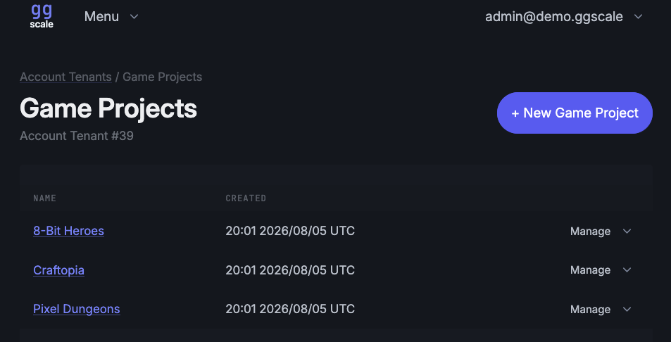

# ggscale

ggscale is an open source backend for multiplayer games. It has player accounts and auth, game sessions and lobbies, matchmaking and parties, peer-to-peer relay, dedicated servers (beta), cloud saves, leaderboards, friends, and a control panel to manage it all.



## ggscale Cloud

If you prefer a managed service, run your game on ggscale Cloud and leave the hosting to us.

**[Try ggscale Cloud →](https://ggscale.com)**

## Documentation

Full documentation is in the [ggscale wiki](https://github.com/automoto/gg-scale/wiki): architecture, features, API routes, and onboarding guides.

The [HTTP API reference](https://automoto.github.io/ggscale-api-docs/) lists every `/v1` operation, with request and response schemas and which API key each one takes. It is generated from [`openapi.yaml`](openapi.yaml).

For more technical detail, ask DeepWiki:

[](https://deepwiki.com/automoto/gg-scale)

## SDKs

- Go: [ggscale-go](https://github.com/automoto/ggscale-go)
- C# (Unity, MonoGame, Godot): [gg-scale-sdk-C-Sharp](https://github.com/automoto/gg-scale-sdk-C-Sharp)

## Local development and quickstart

You need Docker and make. The tests also need Go 1.26.

```bash
git clone https://github.com/automoto/gg-scale.git
cd gg-scale
cp .env.example .env
make up
curl -s localhost:8080/v1/healthz
```

The health check returns `"status": "ok"` with the server version and commit, and the header `X-API-Version: v1`.

`make up` starts the basic stack: `ggscale-server`, Postgres, and Mailpit, an SMTP catcher with a web UI at `http://localhost:8025`. If the Mailpit ports are already in use, set `MAILPIT_SMTP_PORT` and `MAILPIT_HTTP_PORT`.

## Control panel setup

1. Read the one-time token with `make bootstrap-token`. The server logs show the token file path (`./data/bootstrap.token`) but never the token value.
2. Open `http://localhost:8080/v1/control-panel/setup`, create the first platform admin, and sign in.
3. Create an Account Tenant, a Game Project, and a publishable API key. Your game client sends the publishable key on every call as `Authorization: Bearer <api_key>`. Create a secret key only for a game server or backend, and never ship it in a game.

The [wiki onboarding guide](https://github.com/automoto/gg-scale/wiki) covers the rest.

## Common commands

Run `make help` for the full list.

| Target | What it does |
|---|---|
| `make up` / `make down` / `make clean` | Basic dev stack (server, Postgres, SMTP). |
| `make bootstrap-token` | Print the control panel bootstrap token from `./data/bootstrap.token`. |
| `make test` | Unit tests with `-race`. |
| `make test-integration` | Integration tests (Postgres via Testcontainers). |
| `make e2e` | End-to-end suite against the running `make up` stack. |
| `make check` | Lint and unit tests, the same gate as CI. |

## Testing

Every test target runs with only Docker and this checkout. Together they cover the GA features: auth and players, game sessions and signaling, matchmaking and parties, P2P relay, cloud saves, leaderboards, friends and invites, and the control panel.

The game server fleet feature is beta and not ready for production.

## Contributing and license

See [CONTRIBUTING.md](CONTRIBUTING.md). ggscale is licensed under the [Apache License 2.0](LICENSE).
